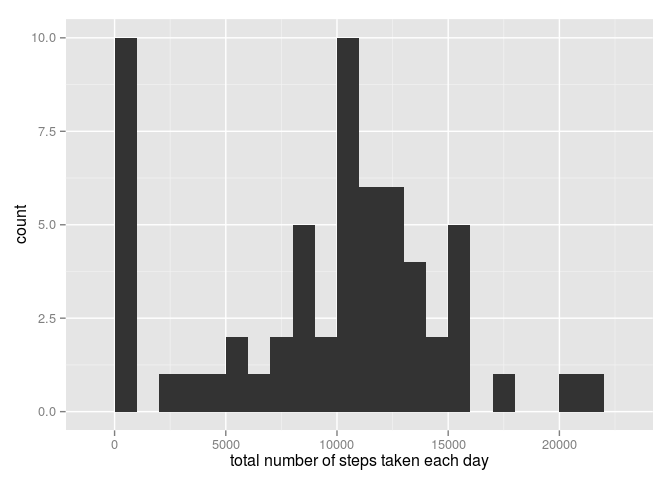
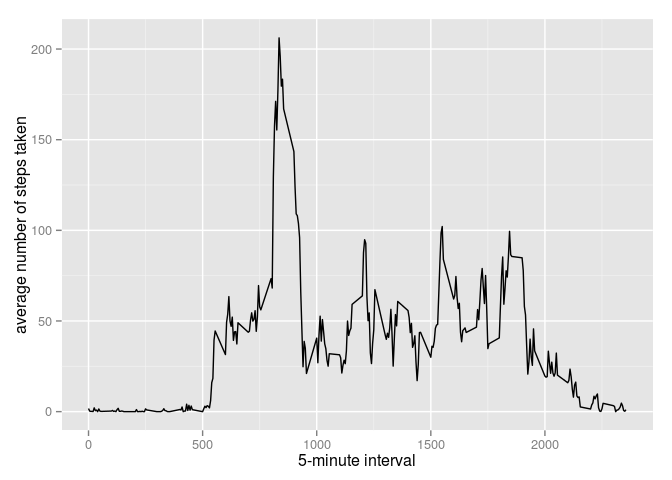
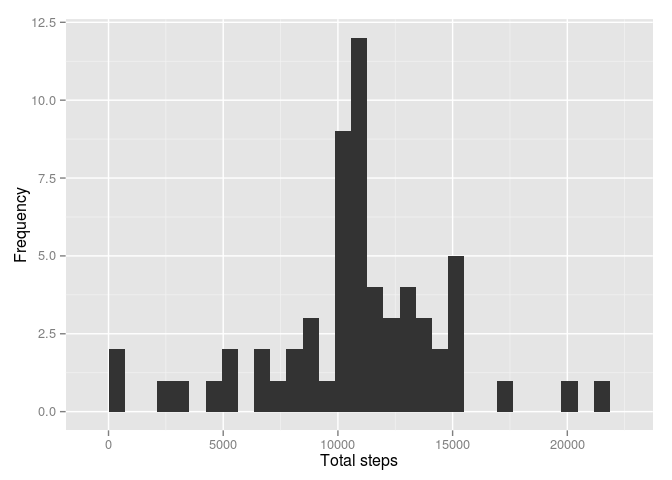
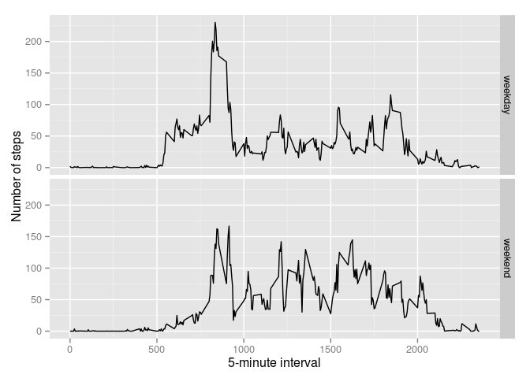

# Reproducible Research: Peer Assessment 1


## Loading and preprocessing the data


```r
if (!file.exists("activity.csv")) {
    unzip("activity.zip")
}
data <- read.csv("activity.csv")
```

## What is mean total number of steps taken per day?

```r
total.steps <- tapply(data$steps, data$date, FUN = sum, na.rm = TRUE)

mean(total.steps, na.rm = TRUE)
```

```
## [1] 9354.23
```

```r
median(total.steps, na.rm = TRUE)
```

```
## [1] 10395
```

```r
library(ggplot2)
```

```
## Warning: package 'ggplot2' was built under R version 3.1.2
```

```r
qplot(total.steps, binwidth = 1000, xlab = "total number of steps taken each day")
```

 

## What is the average daily activity pattern?

```r
library(ggplot2)
averages <- aggregate(x = list(steps = data$steps), by = list(interval = data$interval), 
    FUN = mean, na.rm = TRUE)
ggplot(data = averages, aes(x = interval, y = steps)) + geom_line() + xlab("5-minute interval") + 
    ylab("average number of steps taken")
```

 

On average across all the days in the dataset, the 5-minute interval contains the maximum number of steps?


```r
averages[which.max(averages$steps), ]
```

```
##     interval    steps
## 104      835 206.1698
```

## Imputing missing values

Identify the number of intervals with missing step counts ("NA's"):

```r
summary(data$steps)
```

```
##    Min. 1st Qu.  Median    Mean 3rd Qu.    Max.    NA's 
##    0.00    0.00    0.00   37.38   12.00  806.00    2304
```

All of the missing values are filled in with mean value for that 5-minute interval.


```r
fill.value <- function(steps, interval) {
    filled <- NA
    if (!is.na(steps)) 
        filled <- c(steps) else filled <- (averages[averages$interval == interval, "steps"])
    return(filled)
}
filled.data <- data
filled.data$steps <- mapply(fill.value, filled.data$steps, filled.data$interval)
```
Let's compare the mean and median steps for each day between the original data set and the imputed data set.


```r
total.steps <- tapply(filled.data$steps, filled.data$date, FUN = sum)
mean(total.steps)
```

```
## [1] 10766.19
```

```r
median(total.steps)
```

```
## [1] 10766.19
```

```r
qplot(total.steps, xlab = "Total steps", ylab = "Frequency")
```

```
## stat_bin: binwidth defaulted to range/30. Use 'binwidth = x' to adjust this.
```

 

Imputing the missing data has increased the average number of steps.

## Are there differences in activity patterns between weekdays and weekends?

```r
typeday<- function(date) {
    if (weekdays.Date(date) %in% c("sábado", "domingo")) {
        return("weekend")
    } else {
        return("weekday")
    }
}
filled.data$date <- as.Date(filled.data$date)
filled.data$day <- sapply(filled.data$date, FUN = typeday)

averages <- aggregate(steps ~ interval + day, data = filled.data, mean)
ggplot(averages, aes(interval, steps)) + geom_line() + facet_grid(day ~ .) + 
    xlab("5-minute interval") + ylab("Number of steps")
```

 

